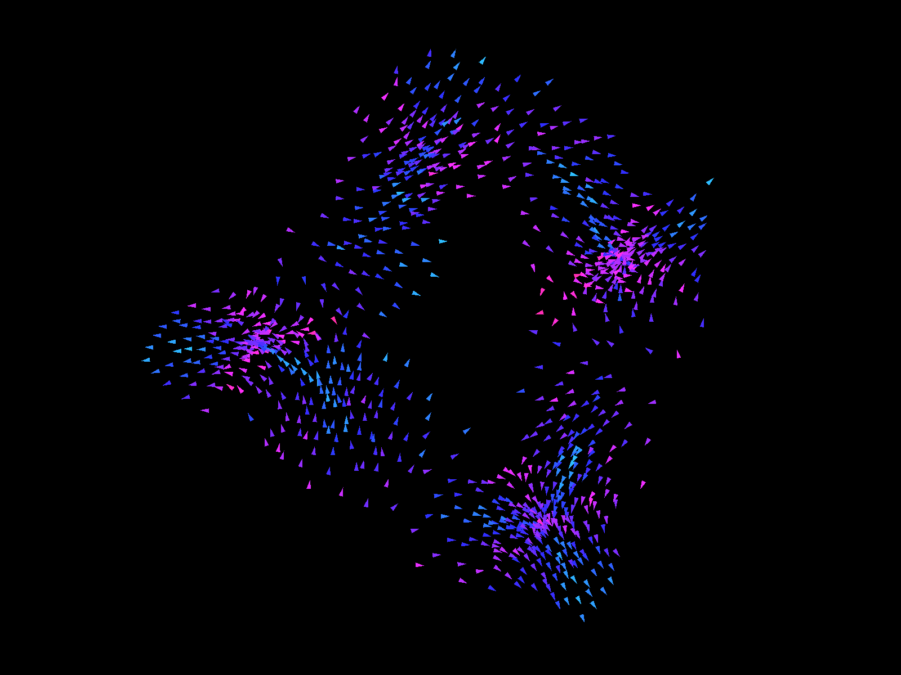
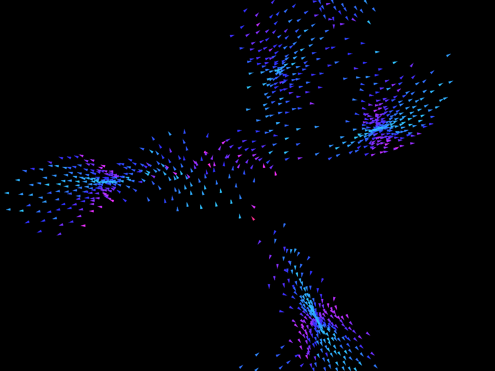
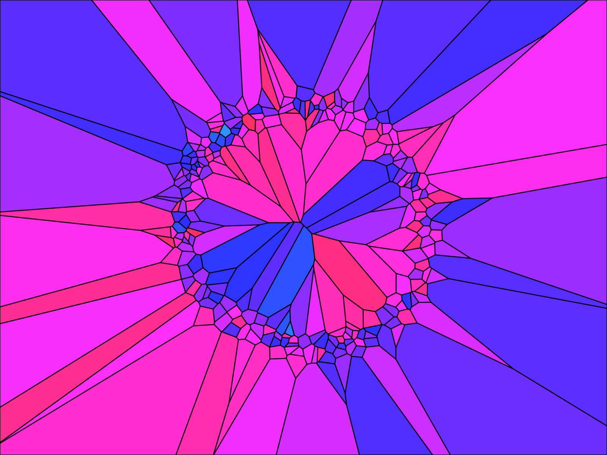
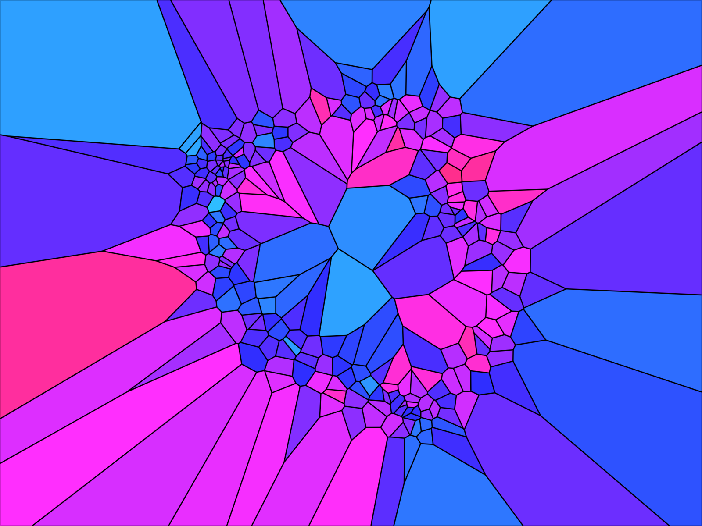

# OPENRNDR-based flocking simulations

I wanted to learn more about [OPENRNDR](https://openrndr.org), a Kotlin framework for creative coding,
and to visualise Craig Reynolds's [boids](https://www.red3d.com/cwr/boids/) model of flocking. In Reynolds's model
each boid follows three local steering rules: keep apart from close neighbours (separation), match their heading
(alignment) and move towards their centre (cohesion). No boid knows the shape of the flock, yet a flock forms.

## Boids

The boids code began as a port of Daniel Shiffman's [flocking example](https://processing.org/examples/flocking.html)
in Processing. From there, the project moved in two directions, both aimed at simulating and drawing many more boids.

**Finding neighbours.** In the original, every boid checks every other boid on every frame, so the work grows with the
square of the flock size. This project builds a [k-d tree](https://en.wikipedia.org/wiki/K-d_tree) of boid positions
each frame and asks it only for the boids within the neighbour radius. The tree keeps the simulation responsive with a
large flock.

**Drawing.** OPENRNDR's way of drawing the shapes proved slow at this scale. The project instead writes every boid's
triangle into a single vertex buffer and draws the whole flock with one batched call per frame.

|                                     |                                     |
|:-----------------------------------:|:-----------------------------------:|
|  |  |

## Voronoi boids

The second program experiments with visualising the flock's movement through Voronoi diagrams. On every frame it
divides the window into cells, one per boid, each covering the area closer to that boid than to any other. It colours
each cell by its boid's speed. As the flock moves, the cells shift and reshape with it.

|                                                   |                                                   |
|:-------------------------------------------------:|:-------------------------------------------------:|
|  |  |

## Running

```bash
./gradlew run                                                           # boids
./gradlew run -Popenrndr.application=voronoiboids.VoronoiFlockingKt     # Voronoi boids
```

Click anywhere in the window to add more boids at the cursor.
